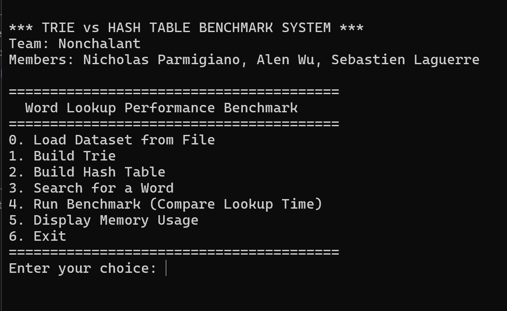
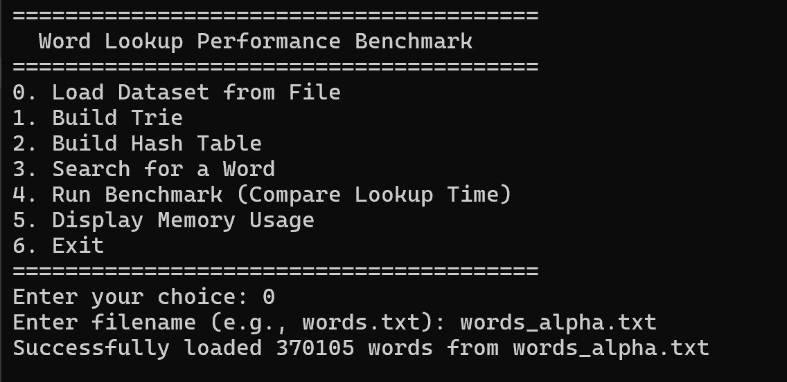
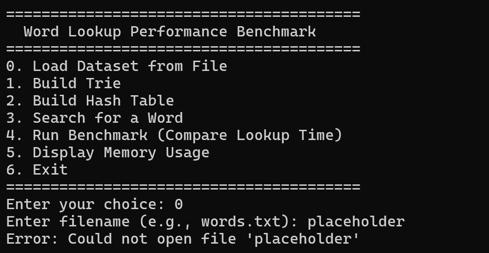
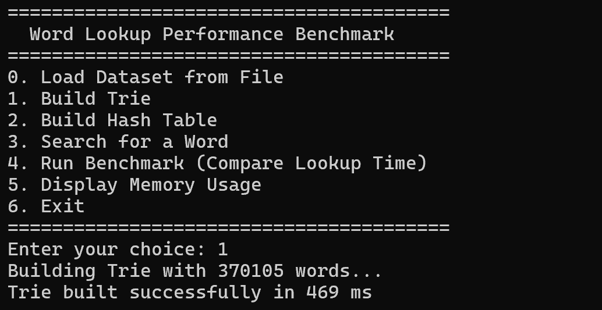
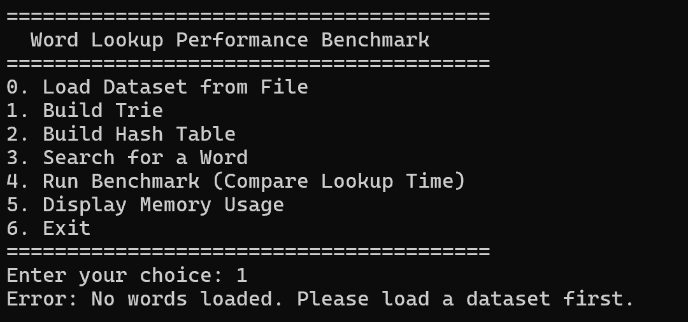
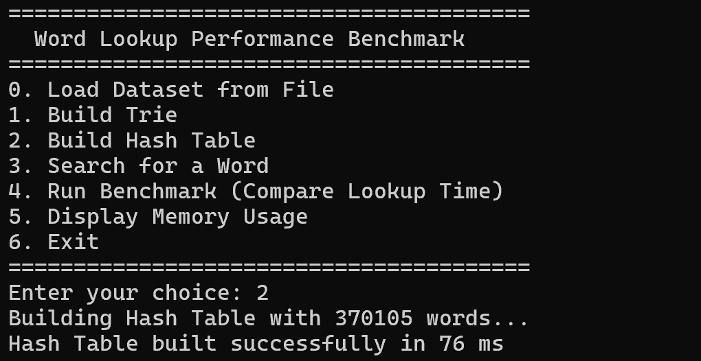
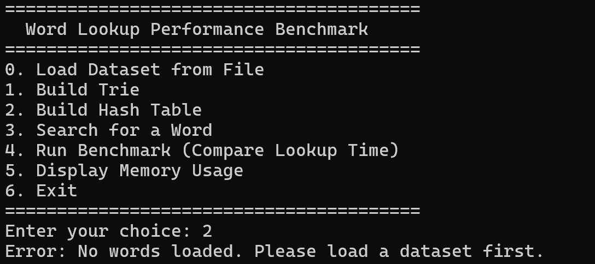
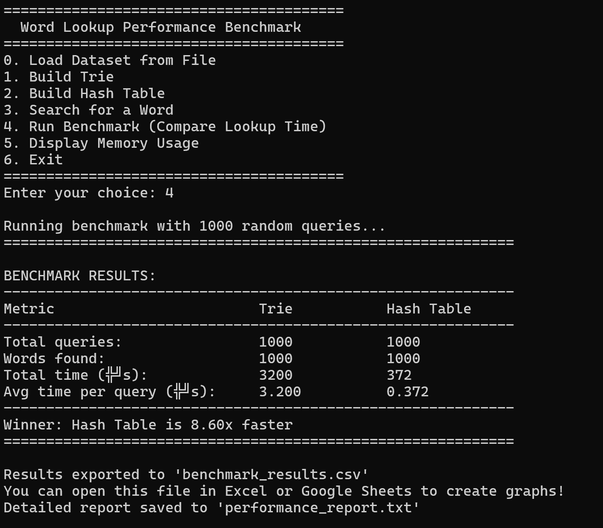
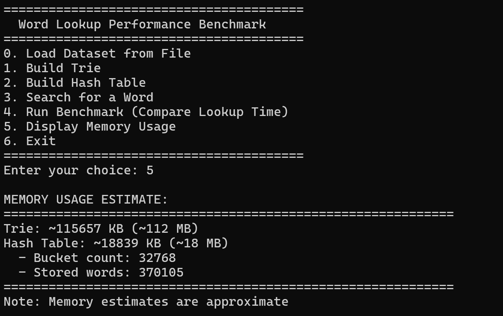

# COP3530_Project2
#### Team name: Nonchalant
#### Team members: Nicholas Parmigiano, Sebastien Laguerre, Alen Wu

## What This Program Does
This program compares the two data structures, Tries and Hash Tables, on their efficiency for large-scale word lookups.

## Video Demo
(insert link to video here)

## How to Compile the Program
### Use Makefile:
#### The program includes a makefile with three instructions:

`make build`: compiles and builds the executable for the program. The executable will be named **project2.exe**

`make run`: runs the executable **project2.exe**

`make clean`: deletes the executable **project2.exe**

## Program Functions

This is what you will see after running the executable:

*Fig. 1: Program Menu*

There are 7 different actions you can do in the program, numbered from 0 to 6. You can choose to do any of them by inputting the numbers 0 to 6 into the `Enter your choice:` prompt.

### Option 0: Load Dataset from File

By choosing this option, you can load a word dataset of your choice into the program. We have provided an example dataset `words_alpha.txt` which you can use.

*Fig. 2: Successfully loaded the example dataset*

*Fig. 3: Failed when loading a dataset*

### Option 1: Build Trie

By choosing this option, the program automatically builds a Trie using the dataset you loaded into the program.

*Fig. 4: Successfully builded the Trie*

*Fig. 5: Failed when building the Trie*

### Option 2: Build Hash Table

By choosing this option, the program automatically builds a Hash Table using the dataset you loaded into the program.

*Fig. 6: Successfully builded the Hash Table*

*Fig. 7: Failed when building the Hash Table*

### Option 3: Search for a Word

By choosing this option, you can search for a word of your choice.

*Fig. 8: Searching for word **whale** in the two data structures*

### Option 4: Run Benchmark (Compare Lookup Time)

By choosing this option, you can run a benchmark on the two data structures, Trie and Hash Table, to compare the performance between the two. The results will be stored in two files: `benchmark_results.csv`, which stores the data in a table, and `performance_report.txt`, which stores more detail about the comparison.

*Fig. 9: Results after running a benchmark*

### Option 5: Display Memory Usage

By choosing this option, the program provides an estimated value of memory used by the two data structures, which can be used to compare the two's performance.

*Fig. 10: Results of the memory usage of the two data structures*

### Option 6: Exit

By choosing this option, the program kills itself.